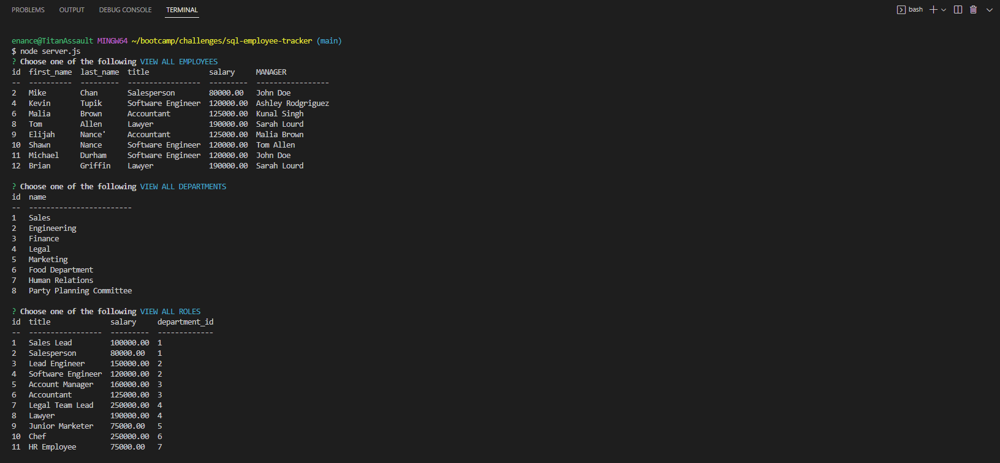

# sql-employee-tracker

[Video Runthrough Link](https://drive.google.com/file/d/1OX42J-DHRwWHuJNmEPbde336ouG5i6vZ/view)

## Description
This is a program that allows you to view employee databases with tables that include data about employees, departments within the company, and roles within those departments. This was created with JavaScript and MySQL for the backend development. You have the ability to create new employees, roles, and departments as well as update employee role information. With each employee you can see their name, role, salary, and manger.

## Visuals
